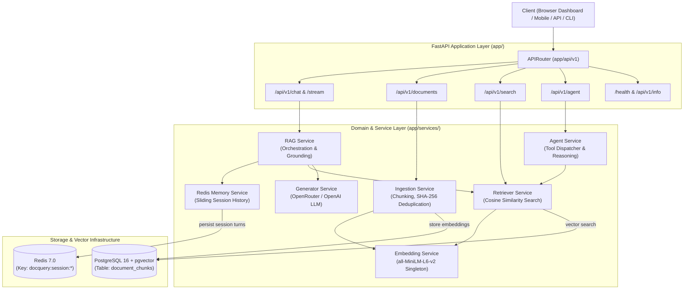

# DocQuery: Production-Grade Conversational RAG Engine

<div align="center">


<p align="center">
  <strong>An enterprise-ready Conversational Retrieval-Augmented Generation (RAG) platform featuring dense vector similarity search, multi-turn Redis dialogue memory, citation grounding, tool-augmented reasoning, and a modern glassmorphic dashboard.</strong>
</p>

[Quickstart](#quickstart) • [Architecture](#architecture) • [API Reference](#api-endpoints) • [Interactive Web UI](#interactive-dashboard) • [Testing](#testing)

</div>

---

## 🌟 Key Engineering Highlights

- **⚡ Dense Vector Semantic Search**: Leverages PostgreSQL with the **`pgvector`** extension to perform fast $K$-Nearest Neighbor (cosine distance `<=>`) lookups over 384-dimensional normalized dense embeddings generated by `sentence-transformers/all-MiniLM-L6-v2`.
- **🧠 Multi-Turn Conversational Memory**: Employs **Redis** as a session-scoped message cache. Follow-up questions (e.g., *"What about interns?"* after asking *"How many leave days do employees get?"*) are resolved in context while automatically maintaining a sliding window to prevent token explosion.
- **🛡️ Deduplication & Incremental Ingestion**: Uses **SHA-256** content hashing before chunking and embedding. Re-uploading or scanning unchanged documents skips computation entirely, saving compute cycles and API tokens.
- **🌊 Real-Time Token Streaming**: Provides both standard JSON responses and a **Server-Sent Events (SSE)** endpoint (`/api/v1/chat/stream`) for fluid real-time token delivery to frontends.
- **🤖 Tool-Augmented Agentic Reasoning**: Integrates tools for document lookup and numerical calculations (e.g. percentage comparison of policy allowances) with audit logging.
- **🎨 Glassmorphic Dark-Mode UI**: Built-in interactive dashboard served directly by FastAPI at `/` for live testing of Chat, Document Library, Vector Explorer, and Agent tasks.
- **🐳 Full Containerization**: One-click orchestration of the FastAPI app, PostgreSQL + pgvector, and Redis via Docker Compose.

---

## 📐 Architecture



---

## 📂 Project Structure

```
DocQuery/
├── app/
│   ├── api/
│   │   ├── v1/
│   │   │   ├── endpoints/
│   │   │   │   ├── agent.py          # Tool-augmented reasoning endpoints
│   │   │   │   ├── chat.py           # Conversational RAG & SSE streaming
│   │   │   │   ├── documents.py      # File upload, list, delete, folder scan
│   │   │   │   ├── health.py         # Diagnostic telemetry & system info
│   │   │   │   └── search.py         # Direct vector similarity search
│   │   │   └── router.py             # Central API v1 router
│   ├── core/
│   │   ├── config.py                 # Pydantic Settings loading from .env
│   │   └── logging.py                # Structured colored application logger
│   ├── db/
│   │   ├── models.py                 # SQLAlchemy DocumentChunk model with pgvector
│   │   └── session.py                # Connection pooling & get_db dependency
│   ├── schemas/
│   │   ├── agent.py                  # Agent request/response Pydantic schemas
│   │   ├── chat.py                   # ChatRequest, ChatResponse, SourceChunk
│   │   ├── document.py               # Document metadata & ingestion schemas
│   │   ├── health.py                 # System health and latency telemetry
│   │   └── search.py                 # Semantic search query & match schemas
│   ├── services/
│   │   ├── agent_service.py          # Multi-step reasoning tool dispatcher
│   │   ├── embedding.py              # Thread-safe SentenceTransformer singleton
│   │   ├── generator.py              # OpenRouter LLM completion & streaming
│   │   ├── ingestion.py              # Text chunking, SHA-256 hash deduplication
│   │   ├── memory.py                 # Redis session memory with in-memory fallback
│   │   ├── rag_service.py            # High-level RAG query orchestrator
│   │   └── retriever.py              # Cosine distance vector retrieval
│   └── main.py                       # FastAPI application factory, CORS, static UI
├── documents/                        # Knowledge base document directory
│   └── company_policy.txt            # Sample employee & intern leave policy
├── memory/                           # Backward compatibility adapter for legacy scripts
├── rag/                              # Backward compatibility adapter for legacy scripts
├── static/                           # Interactive Glassmorphic Web Dashboard
│   ├── index.html                    # Single-page UI with 4 feature tabs
│   ├── css/style.css                 # Sleek dark-mode aesthetic with animations
│   └── js/app.js                     # Frontend API controller & modal citations
├── tests/                            # Automated test suite
│   ├── test_api.py                   # FastAPI endpoint & lifecycle tests
│   ├── test_memory.py                # Redis session memory & windowing tests
│   └── test_retriever.py             # Chunking algorithm & vector search tests
├── .env.example                      # Documented environment variable template
├── docker-compose.yml                # Multi-container Postgres + Redis + API
├── Dockerfile                        # Optimized production container definition
├── requirements.txt                  # Pinned Python package dependencies
├── main.py                           # Root application entry point
└── README.md                         # Project documentation
```

---

## 🚀 Quickstart

### Prerequisites
- Python 3.11+
- PostgreSQL with `pgvector` extension
- Redis Server (local or containerized)
- OpenRouter / OpenAI API key

### 1. Clone & Setup Environment

```powershell
git clone https://github.com/Selvkarthik/DocQuery.git
cd DocQuery

# Create and activate virtual environment
python -m venv venv
.\venv\Scripts\Activate.ps1    # Windows
# source venv/bin/activate     # Linux / macOS

# Install dependencies
pip install -r requirements.txt
```

### 2. Configure Environment Variables

Copy `.env.example` to `.env` and fill in your database credentials and API key:

```ini
API_KEY=sk-or-v1-your-openrouter-key-here
OPENROUTER_MODEL=inclusionai/ling-3.0-flash-fin:free
DB_USER=postgres
DB_PWD=your_postgres_password
DB_HOST=localhost
DB_PORT=5432
DB=rag_db
REDIS_HOST=localhost
REDIS_PORT=6379
```

### 3. Ingest Documents & Start the Server

```powershell
# Index documents from /documents directory
python -m rag.ingest

# Launch the FastAPI application
python main.py
```

Open your browser to:
- **Interactive Web Dashboard**: [http://localhost:8000/](http://localhost:8000/)
- **Swagger Interactive API Documentation**: [http://localhost:8000/docs](http://localhost:8000/docs)
- **ReDoc Documentation**: [http://localhost:8000/redoc](http://localhost:8000/redoc)

---

## 🐳 Running with Docker Compose

Deploy the entire stack (PostgreSQL + pgvector, Redis, and DocQuery FastAPI) with one command:

```bash
docker compose up --build
```

---

## 📡 API Endpoints

### 💬 Chat & Conversational RAG
| Method | Endpoint | Description |
|---|---|---|
| `POST` | `/api/v1/chat` | Conversational query with Redis memory and citation grounding |
| `POST` | `/api/v1/chat/stream` | Real-time Server-Sent Events (SSE) token stream |
| `GET` | `/api/v1/chat/history/{session_id}` | Retrieve conversation turns for a session |
| `DELETE` | `/api/v1/chat/history/{session_id}` | Clear conversation memory for a session |

### 📂 Document Management
| Method | Endpoint | Description |
|---|---|---|
| `POST` | `/api/v1/documents/upload` | Upload `.txt` or `.md` file, chunk, embed, and index |
| `POST` | `/api/v1/documents/ingest-folder` | Re-scan the `/documents` directory for new/updated files |
| `GET` | `/api/v1/documents` | List indexed documents with chunk count and SHA-256 hash |
| `DELETE` | `/api/v1/documents/{source_name}` | Delete document and its vector chunks |

### 🔍 Vector Search & Agent
| Method | Endpoint | Description |
|---|---|---|
| `POST` | `/api/v1/search` | Direct pgvector semantic similarity search without LLM |
| `POST` | `/api/v1/agent/run` | Multi-step reasoning agent with tools |

### ⚡ System Diagnostics
| Method | Endpoint | Description |
|---|---|---|
| `GET` | `/health` | Live connection health for Database, pgvector, and Redis |
| `GET` | `/api/v1/info` | Telemetry: vector dimension, models, total indexed chunks |

---

## 💻 Sample API Usage

### 1. Conversational Query with Memory

```bash
curl -X POST "http://localhost:8000/api/v1/chat" \
  -H "Content-Type: application/json" \
  -d '{
    "question": "How many days of annual leave do interns receive?",
    "session_id": "hr-session-1",
    "top_k": 2,
    "similarity_threshold": 0.4
  }'
```

**Response**:
```json
{
  "answer": "Interns receive 10 days of annual leave according to company policy.",
  "session_id": "hr-session-1",
  "question": "How many days of annual leave do interns receive?",
  "sources": [
    {
      "source": "company_policy.txt",
      "chunk_index": 0,
      "content": "Employees receive 22 days of annual leave. Interns receive 10 days of annual leave.",
      "similarity": 0.742,
      "distance": 0.258
    }
  ],
  "model": "inclusionai/ling-3.0-flash-fin:free",
  "history_turns_included": 0
}
```

### 2. Follow-Up Question (Testing Contextual Memory)

```bash
curl -X POST "http://localhost:8000/api/v1/chat" \
  -H "Content-Type: application/json" \
  -d '{
    "question": "What about regular employees?",
    "session_id": "hr-session-1"
  }'
```

The system automatically references the preceding turn from Redis to answer accurately!

### 3. Direct Vector Search

```bash
curl -X POST "http://localhost:8000/api/v1/search" \
  -H "Content-Type: application/json" \
  -d '{
    "query": "leave request notice requirement",
    "top_k": 3
  }'
```

---

## 🧪 Testing

The repository includes comprehensive automated unit and integration tests covering chunking algorithms, pgvector similarity scoring, Redis memory windowing, and FastAPI endpoints:

```powershell
.\venv\Scripts\python.exe -m pytest tests/ -v
```

**Results**:
```
tests/test_api.py::test_health_endpoint PASSED                           [  9%]
tests/test_api.py::test_system_info_endpoint PASSED                      [ 18%]
tests/test_api.py::test_search_endpoint PASSED                           [ 27%]
tests/test_api.py::test_documents_list_endpoint PASSED                   [ 36%]
tests/test_api.py::test_legacy_ask_endpoint PASSED                       [ 45%]
tests/test_api.py::test_v1_chat_and_history_lifecycle PASSED             [ 54%]
tests/test_memory.py::test_memory_add_and_load PASSED                    [ 63%]
tests/test_memory.py::test_memory_turn_trimming PASSED                   [ 72%]
tests/test_retriever.py::test_chunk_sentences PASSED                     [ 81%]
tests/test_retriever.py::test_split_text_into_chunks PASSED              [ 90%]
tests/test_retriever.py::test_retriever_empty_query PASSED               [ 95%]
tests/test_retriever.py::test_retriever_query PASSED                     [100%]

============================= 12 passed in 18.2s =============================
```

---

## 🖥️ Interactive CLI Assistant

You can also run DocQuery directly in your terminal using the interactive CLI:

```powershell
python -m rag.agent
```

---

## 📄 License

Distributed under the MIT License. See `LICENSE` for more information.
