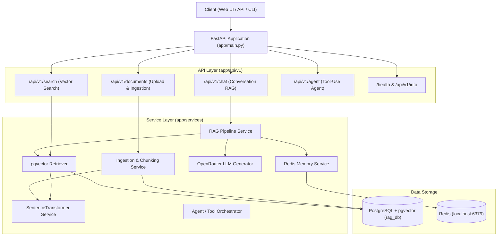

# Implementation Plan: Production-Ready DocQuery RAG Portfolio Project

Transform **DocQuery** from a basic prototype into an enterprise-grade, portfolio-ready **Conversational RAG (Retrieval-Augmented Generation)** system. The project will preserve the core architecture (PostgreSQL + pgvector, SentenceTransformers, Redis memory, OpenRouter LLM) while establishing clean software engineering standards, comprehensive FastAPI endpoints, multi-document ingestion, automated testing, containerization, and a modern interactive UI.

---

## User Review Required

> [!IMPORTANT]
> **No Breaking Changes to Core Idea**:
> All existing workflows (`pgvector` cosine similarity, `all-MiniLM-L6-v2` embeddings, Redis session memory, and OpenRouter LLM generation) will be preserved.
> Backward-compatible bridges (`rag/` and `memory/`) will be retained so that any existing scripts (`python -m rag.agent`, `python -m rag.ingest`) continue to work seamlessly.

> [!NOTE]
> **Services Required**:
> The system connects to PostgreSQL with `pgvector` and Redis. Both are currently running and verified healthy on your local system. A `docker-compose.yml` file will also be provided for one-click setup anywhere.

---

## Architecture Overview



---

## Proposed Changes

### 1. Configuration & Core Infrastructure (`app/core/`)

#### [NEW] [config.py](file:///c:/Users/sselv/OneDrive/Desktop/RAG/app/core/config.py)
- Pydantic Settings class loading `.env` variables with defaults:
  - Database settings (`DB_USER`, `DB_PWD`, `DB_HOST`, `DB_PORT`, `DB`, connection pooling).
  - Redis settings (`REDIS_HOST`, `REDIS_PORT`, `REDIS_DB`, `REDIS_TTL`).
  - LLM settings (`API_KEY`, `OPENROUTER_MODEL`, `OPENROUTER_BASE_URL`).
  - Embedding settings (`EMBEDDING_MODEL_NAME`, vector dimension = 384).
  - RAG defaults (`TOP_K`, `SIMILARITY_THRESHOLD`, `MAX_HISTORY_TURNS`).

#### [NEW] [logging.py](file:///c:/Users/sselv/OneDrive/Desktop/RAG/app/core/logging.py)
- Formatted, structured application logger with clean timestamping and level formatting.

---

### 2. Database & Data Models (`app/db/`)

#### [NEW] [session.py](file:///c:/Users/sselv/OneDrive/Desktop/RAG/app/db/session.py)
- SQLAlchemy `create_engine` with connection pooling (`pool_pre_ping=True`, `pool_size=10`).
- FastAPI dependency `get_db()` yielding database sessions with automatic cleanup and rollback on exceptions.

#### [NEW] [models.py](file:///c:/Users/sselv/OneDrive/Desktop/RAG/app/db/models.py)
- SQLAlchemy `DocumentChunk` model with pgvector `Vector(384)`, chunk metadata, indexed source and file_hash.
- Backward compatibility: `rag/models.py` re-exports from this module.

---

### 3. Pydantic Schemas (`app/schemas/`)

#### [NEW] [chat.py](file:///c:/Users/sselv/OneDrive/Desktop/RAG/app/schemas/chat.py)
- `ChatRequest`: `question`, `session_id`, optional `top_k`, `similarity_threshold`.
- `SourceChunk`: `content`, `source`, `chunk_index`, `similarity`, `distance`.
- `ChatResponse`: `answer`, `session_id`, `question`, `sources`, `model`, `history_turns_included`.
- `Message`: `role`, `content`, `timestamp`.
- `SessionHistoryResponse`: `session_id`, `messages`, `total_messages`.

#### [NEW] [document.py](file:///c:/Users/sselv/OneDrive/Desktop/RAG/app/schemas/document.py)
- `DocumentSummary`: `source`, `chunk_count`, `file_hash`.
- `DocumentUploadResponse`: `filename`, `chunks_created`, `status`, `message`.
- `DocumentListResponse`: `documents`, `total_documents`, `total_chunks`.

#### [NEW] [search.py](file:///c:/Users/sselv/OneDrive/Desktop/RAG/app/schemas/search.py)
- `SearchRequest`: `query`, `top_k`, `similarity_threshold`.
- `SearchResponse`: `query`, `total_matches`, `results`.

#### [NEW] [health.py](file:///c:/Users/sselv/OneDrive/Desktop/RAG/app/schemas/health.py)
- `HealthResponse`: `status`, `database`, `redis`, `embedding_model`, `version`.
- `SystemInfoResponse`: Model configurations, vector dimensions, chunks in DB.

---

### 4. Domain & Service Layer (`app/services/`)

#### [NEW] [embedding.py](file:///c:/Users/sselv/OneDrive/Desktop/RAG/app/services/embedding.py)
- Thread-safe singleton for SentenceTransformer `all-MiniLM-L6-v2`.
- Handles single-query embedding and batch document embeddings.

#### [NEW] [memory.py](file:///c:/Users/sselv/OneDrive/Desktop/RAG/app/services/memory.py)
- Robust Redis conversational memory service:
  - `load_messages(session_id, limit)`
  - `save_messages(session_id, messages, ttl_seconds)`
  - `clear_messages(session_id)`
  - Graceful fallback to in-memory cache if Redis encounters a transient connection error.

#### [NEW] [retriever.py](file:///c:/Users/sselv/OneDrive/Desktop/RAG/app/services/retriever.py)
- Vector similarity search querying PostgreSQL with `<=>` cosine distance.
- Dynamic filtering by similarity threshold and `top_k`.
- Optional filtering by specific document source name.

#### [NEW] [generator.py](file:///c:/Users/sselv/OneDrive/Desktop/RAG/app/services/generator.py)
- OpenRouter / OpenAI client wrapper.
- Structured contextual prompting: incorporates both relevant document context and prior conversation dialogue turns so follow-up queries work accurately.
- Fallback response when context lacks sufficient information.
- Token streaming generator for streaming endpoints.

#### [NEW] [ingestion.py](file:///c:/Users/sselv/OneDrive/Desktop/RAG/app/services/ingestion.py)
- Flexible text & file ingestion:
  - Supports `.txt`, `.md`, and plain text uploads.
  - Sentence-level & sliding window chunking with configurable overlap.
  - SHA-256 deduplication to prevent re-indexing unchanged documents.
  - Delete document and associated chunks from vector store.

#### [NEW] [rag_service.py](file:///c:/Users/sselv/OneDrive/Desktop/RAG/app/services/rag_service.py)
- High-level orchestrator:
  1. Retrieves past conversation turns from `memory.py`.
  2. Embeds user query and searches pgvector via `retriever.py`.
  3. Formulates context-augmented prompt with both memory & citations.
  4. Generates response via `generator.py`.
  5. Updates session history in Redis.

#### [NEW] [agent_service.py](file:///c:/Users/sselv/OneDrive/Desktop/RAG/app/services/agent_service.py)
- Agentic execution incorporating tools:
  - `search_company_document`
  - `calculate_percentage`
  - Multi-step reasoning tool dispatcher.

---

### 5. API Endpoints (`app/api/v1/`)

#### [NEW] [chat.py](file:///c:/Users/sselv/OneDrive/Desktop/RAG/app/api/v1/endpoints/chat.py)
- `POST /api/v1/chat`: Conversational RAG with session memory and citation sources.
- `POST /api/v1/chat/stream`: Server-Sent Events (SSE) streaming answer generation.
- `GET /api/v1/chat/history/{session_id}`: Retrieve session chat log.
- `DELETE /api/v1/chat/history/{session_id}`: Clear session chat log.

#### [NEW] [documents.py](file:///c:/Users/sselv/OneDrive/Desktop/RAG/app/api/v1/endpoints/documents.py)
- `POST /api/v1/documents/upload`: Upload document file and automatically chunk & embed into vector DB.
- `POST /api/v1/documents/ingest-folder`: Trigger re-scan of `documents/` folder.
- `GET /api/v1/documents`: List all indexed documents with chunk count and hash.
- `DELETE /api/v1/documents/{source_name}`: Delete document and its vectors.

#### [NEW] [search.py](file:///c:/Users/sselv/OneDrive/Desktop/RAG/app/api/v1/endpoints/search.py)
- `POST /api/v1/search`: Direct semantic search (pure vector retrieval without LLM).

#### [NEW] [agent.py](file:///c:/Users/sselv/OneDrive/Desktop/RAG/app/api/v1/endpoints/agent.py)
- `POST /api/v1/agent/run`: Tool-augmented query execution.

#### [NEW] [health.py](file:///c:/Users/sselv/OneDrive/Desktop/RAG/app/api/v1/endpoints/health.py)
- `GET /health`: Healthcheck for DB, Redis, and embeddings.
- `GET /api/v1/info`: System capabilities, model details, and DB statistics.

#### [NEW] [router.py](file:///c:/Users/sselv/OneDrive/Desktop/RAG/app/api/v1/router.py)
- Consolidates all v1 endpoint routers.

---

### 6. Interactive Web Dashboard (`static/`)

#### [NEW] [index.html](file:///c:/Users/sselv/OneDrive/Desktop/RAG/static/index.html)
- A sleek, modern dark-mode interface:
  - **Chat Interface**: Multi-session conversational chat with real-time response rendering and clickable source citations showing similarity % and chunk context.
  - **Document Manager**: Drag-and-drop document upload, live document list, and chunk count inspection.
  - **Vector Search Inspector**: Interactive sandbox to test queries and inspect cosine distance scores.
  - **System Health Monitor**: Live latency & connection status indicators for PostgreSQL, pgvector, and Redis.

---

### 7. Application Entrypoint & Backward Compatibility

#### [MODIFY] [main.py](file:///c:/Users/sselv/OneDrive/Desktop/RAG/main.py)
- Connects application lifecycle events (loads embedding model on startup, checks connections).
- Mounts `/api/v1` routes and static files.
- Keeps existing `/ask` endpoint intact for full backwards compatibility.

#### [MODIFY] `rag/` & `memory/` modules
- Re-export functions from `app/` so any legacy scripts (`python -m rag.agent`, `python -m rag.ingest`) continue to work without breaking.

---

### 8. Testing & Portfolio Deliverables

#### [NEW] Automated Tests (`tests/`)
- `tests/test_retriever.py`: Vector search and distance calculation tests.
- `tests/test_memory.py`: Redis session persistence and retrieval tests.
- `tests/test_api.py`: FastAPI endpoint tests using `httpx` / `TestClient`.

#### [NEW] [Dockerfile](file:///c:/Users/sselv/OneDrive/Desktop/RAG/Dockerfile) & [docker-compose.yml](file:///c:/Users/sselv/OneDrive/Desktop/RAG/docker-compose.yml)
- Complete containerization for PostgreSQL (with pgvector), Redis, and the FastAPI application.

#### [NEW] [.env.example](file:///c:/Users/sselv/OneDrive/Desktop/RAG/.env.example)
- Fully documented environment variable template.

#### [NEW] [README.md](file:///c:/Users/sselv/OneDrive/Desktop/RAG/README.md)
- Premium GitHub portfolio README featuring:
  - Tech stack badges.
  - Architecture diagram.
  - API reference with curl snippets.
  - Setup and usage instructions.
  - Engineering deep-dive (pgvector indexing, HNSW vs IVFFlat, Redis memory, chunking trade-offs).

---

## Verification Plan

### Automated Tests
- Run `pytest` across all test files using the virtual environment:
  ```powershell
  .\venv\Scripts\python.exe -m pytest tests/ -v
  ```

### Functional API Verification
- Test all core endpoints using Python script or `curl`:
  1. `GET /health` -> returns 200 OK with DB and Redis statuses.
  2. `POST /api/v1/chat` -> ask question with session memory, verify memory retention across consecutive turns.
  3. `POST /api/v1/search` -> verify vector retrieval and similarity scores.
  4. `GET /api/v1/documents` -> verify indexed documents list.
  5. `POST /api/v1/documents/upload` -> test uploading and indexing a new document.
  6. `GET /` -> verify interactive Web UI loads properly.
